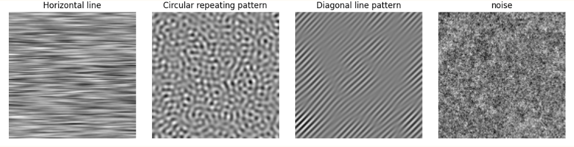

# PBL6-v1
Denoise CT Image using Graph Total Variation
Khử nhiễu ảnh CT sử dụng Graph Total Variation

# Dataset

Data là ảnh CT cắt lớp của phần đầu, Các ảnh có kích thước 128x128 và chia thành các patch có kích thước 16x16.
Các tập train và test được chia thành 2 phần Reference image (ảnh gốc ban đầu) và Noise image (ảnh chứa nhiễu). Reference image và noise image phải cùng file name.

  

<b>Fig.</b> Các loại nhiễu sử dụng 

